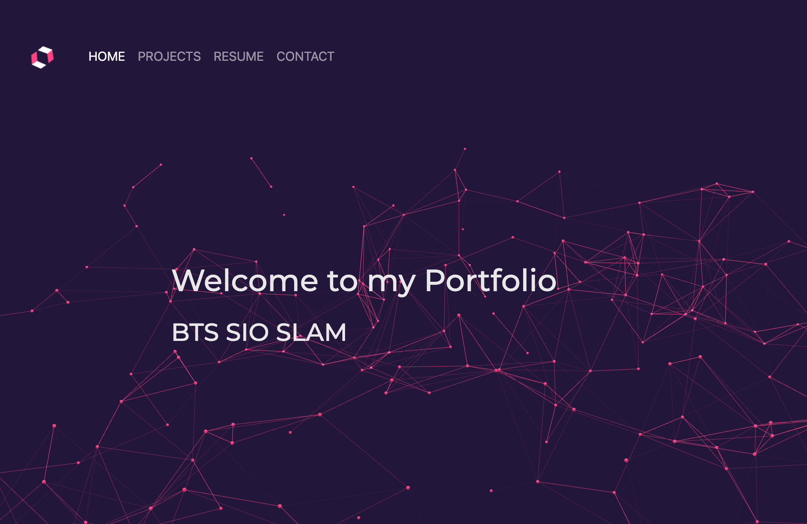

#  :minidisc: BTS SIO SLAM PORTFOLIO

## 👉 Create a Portfolio to display BTS projects 

## Illustration 📸
### 🖥  Desktop illustration
;

## Language/tools 🛠
- HTML5 / CSS3
- Bootstrap5
  

## Goals 🏔
- Discover Bootstrap5

## How to use 🛠

### ⚙️ Launch the development server with Live Server

## Status 🎯
Project not completed

## Context 🗓
Project developed as a junior web developer
